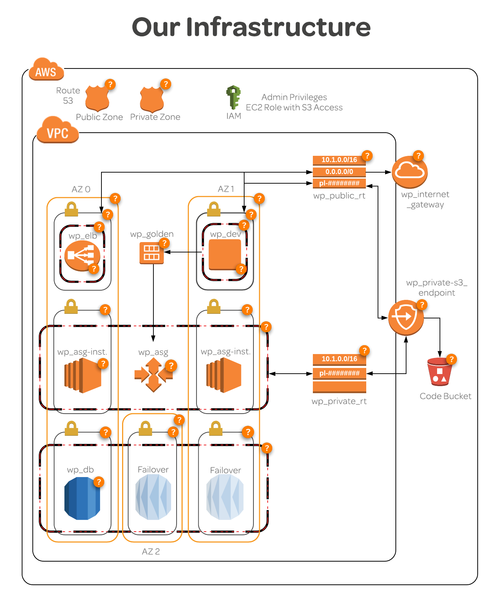

# Example of deploying an AWS environment using Terraform and Ansible

Sets up IAM roles, VPC resources, etc.



# Usage

## Prerequisites

* python
* pip
* awscli
* terraform

## AWS setup

* Setup IAM user for Terraform to have programmatic access
* `aws configure --profile <profile>` n.b. this profile is referenced in `terraform.tfvars` to give Terraform access to AWS

## Check and deploy

```
terraform init
terraform plan
terraform apply
```

# Main files

* `main.tf` - Resource defs
* `variables.tf` - Variable declarations
* `terraform.tfvars` - Variable assignments

`terraform fmt` command reformats the script nicely.

Included `terraform.tfvars` but would include in `.gitignore` normally as it could include sensitive info.